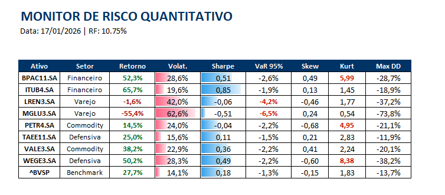
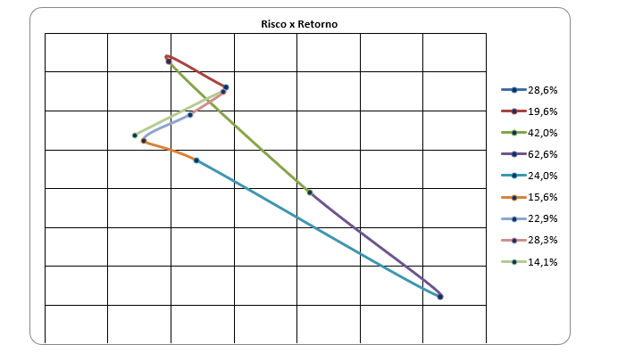
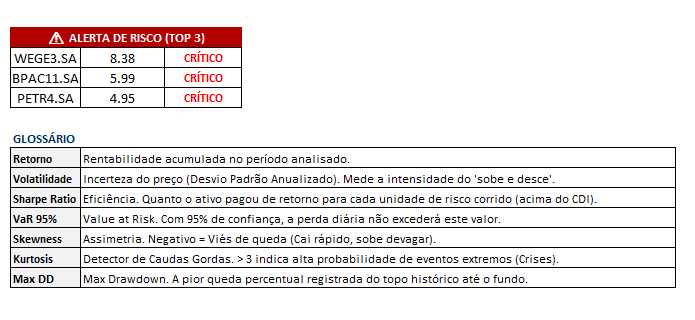

# 🏦 Lab Risco Quant: Monitor de Risco de Mercado & Cisnes Negros


> **"A volatilidade é o preço da admissão. A ruína é o risco a ser evitado."**

Este projeto é um laboratório prático de **Engenharia Financeira** e **Automação de Processos (RPA)**. O objetivo foi construir um pipeline "End-to-End" que monitora ativos da B3, calcula métricas avançadas de risco e gera relatórios de auditoria automaticamente.

---

## 🎯 O Problema de Negócio

Em gestão de portfólio, olhar apenas para a **Volatilidade** (Desvio Padrão) é insuficiente. O verdadeiro perigo para o capital reside nos **Eventos de Cauda (Cisnes Negros)** — movimentos extremos e raros que quebram modelos tradicionais.

Este software resolve isso criando um **Sistema de Alerta Antecipado** que:
1.  **Centraliza Dados:** Baixa e armazena histórico de preços em banco SQL local.
2.  **Mede o Invisível:** Calcula *Kurtosis* (Curtose) e simula cenários de catástrofe (Monte Carlo com Caudas Pesadas).
3.  **Entrega Valor:** Gera um Dashboard Excel e envia por e-mail para a diretoria, sem intervenção manual.

---

## 🚀 Funcionalidades do Pipeline

O sistema opera em 3 estágios automatizados:

### 1. Motor Estatístico & Stress Test
- Cálculo de **VaR 95%**, **Sharpe Ratio** e **Max Drawdown**.
- **Detector de Cisne Negro:** Monitora a *Kurtosis*. Se K > 3, aciona alertas visuais.
- **Simulador de Desastre:** Roda uma Simulação de Monte Carlo usando distribuição *t-Student* (Fat Tails) para prever perdas em cenários de crash, ignorando tendências passadas.

### 2. Reporting "Pixel Perfect"
- Geração de Excel nativo via Python (`openpyxl`).
- Formatação condicional automática e gráficos de dispersão (Risco x Retorno) embutidos.

### 3. 🤖 Smart Distribution Module (RPA)
Automação inteligente de "Última Milha". O sistema detecta o ambiente e decide a estratégia de envio:
- **Prioridade Corporativa:** Tenta conexão via **Outlook (Win32 API)** para ambientes bancários.
- **Fallback Pessoal:** Se falhar, permite envio via **Gmail (SMTP Seguro)**.
- **Modo Simulação:** Caso não haja credenciais, executa todo o fluxo de rede simulado (dry-run).
---

## 📸 Screenshots

*(Exemplo do Relatório Gerado Automaticamente)*

| 📊 Tabela Detalhada | 📉 Gráfico de Eficiência | ⚠️ Alerta de Risco |
| :---: | :---: | :---: |
|  |  |  |

---

## 🛠️ Arquitetura Técnica

O projeto segue princípios de **Governança de Dados** e **Clean Code**:

```text
LAB_RISCO_QUANT/
├── dados/                   # Data Lake (SQLite + Arquivos Brutos)
│   └── mercado.db           # Banco de Dados Histórico (Persistência)
├── reports/                 # Saída dos Relatórios (.xlsx)
├── src/                     # Código Fonte
│   └── scripts/             
│       ├── etl_sql.py       # Ingestão Resiliente (Tratamento de Mudanças API)
│       ├── relatorio_excel.py # Motor de Risco, Monte Carlo e Excel Builder
│       └── enviar_email.py  # Módulo de Distribuição Híbrido (Outlook/Gmail)
├── EXECUTAR_SISTEMA.bat     # Executável "One-Click" para usuário final
├── README.md                # Documentação
└── requirements.txt         # Dependências do Python


# Clone o repositório
git clone https://github.com/igorcarvah/lab_risco_quant.git

# Instale as dependências
pip install pandas numpy matplotlib seaborn scipy yfinance

