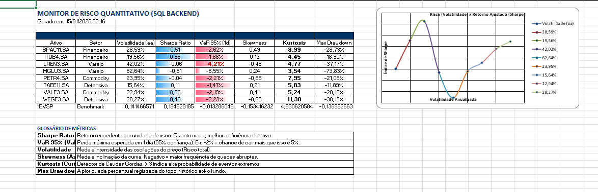

# 🔬 Lab Risco Quant: Análise Estatística & Engenharia de Dados


> *"No mercado financeiro, retorno é vaidade, risco é sanidade."*

Este projeto é um laboratório de **Estatística e Finanças Quantitativas** que aplica metodologias de gestão de risco para analisar o comportamento real de ativos brasileiros (IBOVESPA, Vale, Petrobras, etc.).

O objetivo é ir além da rentabilidade nominal e explorar a anatomia do risco, servindo como parte do portfólio acadêmico do curso de **Estatística da Universidade Anhembi Morumbi**.



---

## 📖 O Problema (Storytelling)

Muitos investidores olham apenas para o gráfico de subida (Retorno). Porém, dois ativos podem entregar o mesmo retorno de 10% ao ano, mas com "viagens" completamente diferentes. Um pode ser uma estrada tranquila (baixa volatilidade), o outro uma montanha-russa emocional (alta volatilidade e *drawdowns* profundos).

**A pergunta que este projeto responde é:**
> *Qual o custo (risco) que estou pagando por cada unidade de retorno que recebo? E quais ativos escondem riscos extremos (Caudas Gordas) que a média simples não mostra?*

---

## 🤖 Diferencial: Automação & Reporting (SQL Backend)

Diferente de scripts acadêmicos comuns, este projeto implementa um pipeline de dados profissional para suportar a tomada de decisão em mesas de operações:

1.  **Engenharia de Dados (ETL):** Os dados não são baixados na hora da análise (o que seria frágil). Um script dedicado (`etl_sql.py`) extrai dados da B3 e os persiste em um banco de dados **SQL (SQLite)**, garantindo integridade e histórico.
2.  **Reporting Automatizado:** O script de análise consome o SQL e utiliza a biblioteca `openpyxl` para gerar Dashboards em Excel com:
    * **Cálculo de VaR 95%** (Value at Risk).
    * **Formatação Condicional:** Alertas visuais automáticos para riscos de cauda.
    * **Gráficos Nativos:** Geração automática de Scatter Plots (Risco x Retorno) via código.

---

## 📐 Fundamentação Matemática (The Quant Engine)

Os cálculos foram implementados via `SciPy` e `NumPy` para garantir precisão estatística nos fundamentos:

### 1. Retorno Ajustado ao Risco (Sharpe Ratio)
Utilizamos o índice de Sharpe para medir a eficiência da alocação.

$$
Sharpe = \frac{R_p - R_f}{\sigma_p}
$$

Onde $R_f$ (Risk Free) foi definido como proxy da taxa básica de juros (CDI).

### 2. Value at Risk (VaR 95%)
Métrica padrão da indústria bancária (Basileia). Calculamos o percentil 5% da distribuição histórica de retornos para estimar a perda máxima esperada em 1 dia com 95% de confiança.

### 3. Momentos Estatísticos (Além da Curva Normal)
O mercado não segue perfeitamente uma Distribuição Normal. Para capturar o "Risco de Cauda" (Cisnes Negros), calculamos os momentos superiores:

* **Assimetria (Skewness - 3º Momento):** Mede se o risco é maior para o lado negativo (quedas abruptas).
$$
Skew = E\left[\left(\frac{X - \mu}{\sigma}\right)^3\right]
$$

* **Curtose (Kurtosis - 4º Momento):** Identifica "Caudas Gordas". Se $Kurtosis > 3$, o ativo possui probabilidade elevada de eventos extremos.
$$
Kurt = E\left[\left(\frac{X - \mu}{\sigma}\right)^4\right]
$$

---

## 🛠️ Arquitetura do Projeto

O projeto segue princípios de **Separação de Responsabilidades (SoC)**:

* **Persistência:** Uso de banco relacional (SQLite) ao invés de arquivos soltos.
* **Orquestração:** Scripts separados para Carga (ETL) e Análise.

### Estrutura de Pastas
```text
lab_risco_quant/
│
├── 📁 dados/                 # Data Warehouse (SQLite)
│   └── mercado.db            # Banco de dados (ignorado no git)
│
├── 📁 reports/               # Saída dos Dashboards
│   ├── Relatorio_Risco.xlsx  # Excel final gerado pelo script
│   └── print_exemplo.png     # Imagem do dashboard para o README
│
├── 📁 scripts/               # Automação
│   ├── etl_sql.py            # Coleta da B3 -> Salva no SQL
│   └── gerar_relatorio.py    # Lê do SQL -> Calcula VaR -> Gera Excel
│
├── .gitignore                # Regras de exclusão
└── README.md                 # Documentação Técnica

# Clone o repositório
git clone https://github.com/igorcarvah/lab_risco_quant.git

# Instale as dependências
pip install pandas numpy matplotlib seaborn scipy yfinance

