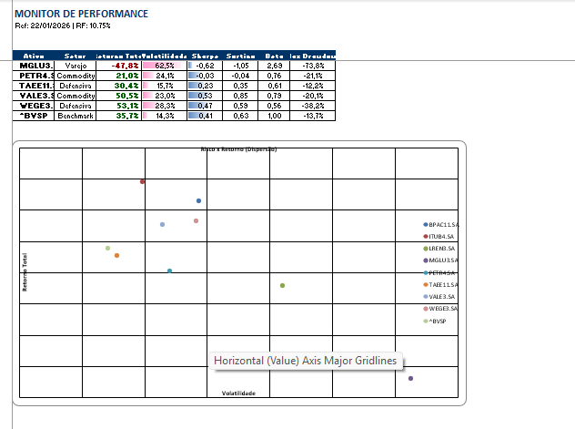
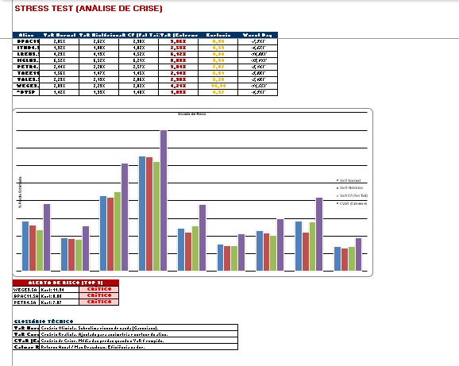
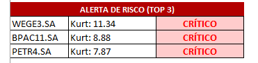

# 🏦 Lab Risco Quant: Monitor de Risco & "Beyond VaR" (V2.0)


> **"Modelos que assumem normalidade em finanças são como mapas que ignoram montanhas. Funcionam bem na planície, mas te matam na escalada."**

Este projeto é um laboratório prático de **Engenharia Financeira** e **Data Science Aplicado**. O objetivo é ir além das métricas tradicionais (Sharpe/Volatilidade) e construir um sistema de monitoramento focado em **Caudas Gordas (Fat Tails)** e proteção de capital, aplicando conceitos de Gestão de Portfólio da **EDHEC Business School**.

---

## 🎯 O Problema de Negócio (A Evolução)

Na versão 1.0, o foco era apenas medir a volatilidade. Porém, a volatilidade não diferencia "risco bom" (alta do ativo) de "risco ruim" (queda). Além disso, o mercado financeiro **não segue uma Curva Normal**.

A **Versão 2.0** resolve isso atacando três pontos cegos:
1.  **A Ilusão da Normalidade:** O VaR tradicional subestima crises. Implementamos métricas que consideram Assimetria e Curtose.
2.  **Eficiência Real:** Substituição do Sharpe por métricas que punem apenas o *downside* (Sortino/Calmar).
3.  **UX para Decisão:** Um Dashboard "Pixel Perfect" gerado via código, eliminando a necessidade de Power BI para análises diárias.

---

## 🚀 Funcionalidades do Pipeline (V2.0)

O sistema opera em um fluxo ETL automatizado (SQL -> Python -> Excel -> Email):

### 1. Motor Quantitativo (EDHEC Inspired)
- **Beyond VaR:** Implementação do **VaR Cornish-Fisher** (ajustado para não-normalidade) e **CVaR (Expected Shortfall)**, que mede a média das perdas em cenários de catástrofe.
- **Eficiência na Dor:** Cálculo de **Sortino Ratio** e **Calmar Ratio** (Retorno / Máximo Drawdown).
- **Detector de Cisne Negro:** Algoritmo que varre a *Kurtosis* dos ativos. Se `K > 3`, o ativo é marcado como **CRÍTICO** automaticamente.

### 2. Reporting & UX (AI Assisted)
- **Excel "Pixel Perfect":** Geração nativa via `openpyxl`.
- **Escada de Risco:** Gráfico de barras comparativo (VaR Normal vs. Real vs. Crise) para visualização imediata do perigo.
- **Visualização Híbrida:** Gráfico de Dispersão (Scatter Plot) sem linhas de conexão errôneas, focado na alocação de ativos.
- *Nota: O código de visualização foi refinado com apoio de IA Generativa para máxima produtividade.*

### 3. 🤖 Smart Distribution (RPA)
Automação de "Última Milha". O sistema detecta o ambiente e envia o report:
- **Prioridade:** Outlook (Win32 API) para ambientes corporativos.
- **Fallback:** Gmail (SMTP Seguro) para uso pessoal.

---

## 📸 Screenshots (O Dashboard)

O relatório é gerado automaticamente e dividido em duas visões estratégicas:

### Aba 1: Monitor de Performance
*Foco na eficiência e retorno ajustado ao risco (Sharpe/Sortino).*


### Aba 2: Stress Test (Beyond VaR)
*Foco na sobrevivência. Comparativo de modelos de risco e alertas de cauda.*


### Alerta Automático de Risco
*Detecção de ativos com alta probabilidade de eventos extremos (Kurtosis > 3).*


---

## 🛠️ Arquitetura Técnica

O projeto segue princípios de **Governança de Dados** e **Clean Code**, separando lógica de cálculo da lógica visual.

```text
LAB_RISCO_QUANT/
├── dados/                   # Data Lake (SQLite)
│   └── mercado.db           # Banco de Dados Histórico
├── reports/                 # Output dos Relatórios (.xlsx)
├── src/                     # Código Fonte
│   └── scripts/             
│       ├── dados_mercado.py   # [NOVO] Biblioteca de Cálculos Quant (Math Engine)
│       ├── etl_sql.py         # Ingestão e Atualização de Dados
│       ├── relatorio_excel.py # Excel Builder (OpenPyXL + Lógica de UX)
│       └── enviar_email.py    # Módulo RPA
├── EXECUTAR_SISTEMA.bat     # Executável "One-Click"
├── README.md                # Documentação
└── requirements.txt         # Dependências


# Clone o repositório
git clone https://github.com/igorcarvah/lab_risco_quant.git

# Instale as dependências
pip install pandas numpy matplotlib seaborn scipy yfinance

